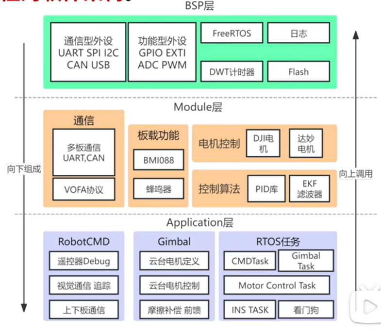

# 方案参考

#有看见其他不错的多多补充

## 一、视觉与云台控制

### IMU闭环与解耦合方案

imu内环：云台角度环、速度环

视觉外环（慢）

[参考视频5:33起](https://www.bilibili.com/video/BV1nNCMBPEsr/?spm_id_from=333.337.search-card.all.click&vd_source=35f20cb10b9d0b3f2eef5f4d58cd80d4)

### 拓展卡尔曼滤波EKF

[参考视频6:55起](https://www.bilibili.com/video/BV1nNCMBPEsr/?spm_id_from=333.337.search-card.all.click&vd_source=35f20cb10b9d0b3f2eef5f4d58cd80d4)

### 自适应PID

根据视觉回传的目标距离调整pid参数，达到控制量近大远小的效果

### 前馈与补偿

### 激光笔安装结构

## 二、底盘

### 转向控制

角度角速度双环pid闭环

### 底盘与云台的通信

自设计uart协议

### 90°直角弯问题

基于状态机的循迹模式切换策略

灰度循迹模式（灰度传感器）/角度闭环模式（陀螺仪）

[参考视频10:13起](https://www.bilibili.com/video/BV1nNCMBPEsr/?spm_id_from=333.337.search-card.all.click&vd_source=35f20cb10b9d0b3f2eef5f4d58cd80d4)

### G3507优化

复用单独adc进行轮询

## 三、视觉

视觉流水线

[参考视频13:40起](https://www.bilibili.com/video/BV1nNCMBPEsr/?spm_id_from=333.337.search-card.all.click&vd_source=35f20cb10b9d0b3f2eef5f4d58cd80d4)

## 四、其他

连接：gh1.25（带锁扣）/自己画板用xh2.54

代码架构：

[参考视频24:42起](https://www.bilibili.com/video/BV1nNCMBPEsr/?spm_id_from=333.337.search-card.all.click&vd_source=35f20cb10b9d0b3f2eef5f4d58cd80d4)
