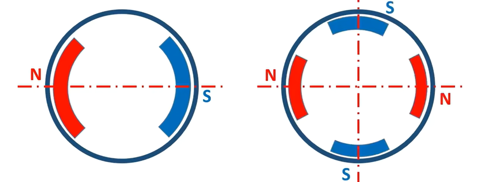
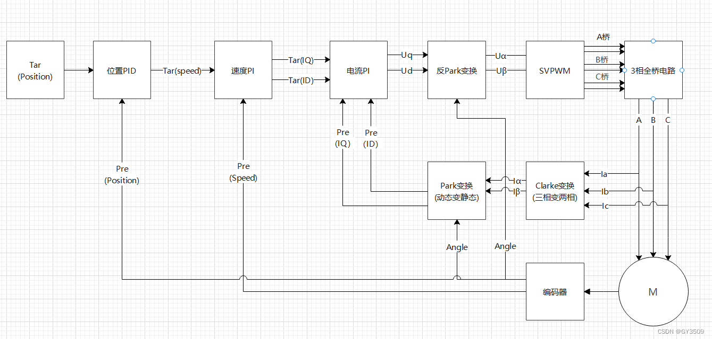

## 基础知识

### 必须掌握

#### 有刷和三相无刷电机的换相区别

```Markdown
三相无刷电机：需要六步换相，因为三相共组合出 6 种通电方式。
```

#### 机械角度、电角度、极对数

```Markdown
极对数 p：转子上有多少组「N 极 + S 极」。
机械角度：电机转子物理实际转过的角度。
电角度：电机内部电磁场周期性变化的角度，是 FOC 控制真正要用的角度。
电角度一圈 360°：代表电机里经过一对 N、S 磁极。
电角度 = 机械角度 × 极对数。
```



#### FOC 为什么需要知道转子角度

```Markdown
FOC 本质：一套算法 + PI 控制环。
FOC 作用：不会让磁场每次突然跳 60°，而是通过连续调节三相电流，让合成磁场更加平滑地旋转。

控制器要知道：现在应该让哪个定子磁极吸引转子，哪个定子磁极排斥转子。
而且因为要始终沿最有效的切线方向推，所以 FOC 需要连续、较准确的电角度。
```

#### 控制框架对比

```Markdown
【TMC9660 方案理解】

视觉 / 上层主控：目标偏右
        ↓
上层控制器计算目标云台角度或目标角速度
        ↓
通过 UART/SPI 将目标值发送给 TMC9660
        ↓
TMC9660读取电机位置反馈
        ↓
位置环：目标位置 − 实际位置
        ↓
生成目标速度
        ↓
速度环：目标速度 − 实际速度
        ↓
生成目标转矩 / 目标 q 轴电流
        ↓
电流环 / 硬件 FOC：结合转子电角度控制 Iq / Id
        ↓
SVPWM 生成三相桥控制信号
        ↓
TMC9660 栅极驱动 + 外部MOS功率级
        ↓
输出 U / V / W 三相功率
        ↓
Yaw轴无刷电机运动
        ↓
MT6701编码器反馈再次测量位置，形成闭环
```

```Markdown
【电赛采用的 SimpleFOC 方案对比】
视觉：目标偏右
        ↓
计算目标云台角度
        ↓
────────────────────────────────────
以下运行在云台 MCU 的 SimpleFOC Library 中

AS5600 读取当前位置
        ↓
位置环 PI：目标位置 − 实际位置
        ↓
输出目标转速
        ↓
速度环 PI：目标转速 − 实际转速
        ↓
输出目标交轴电流（转矩指令）
& 直轴电流一般默认 I_d = 0
        ↓
FOC 算法：结合转子电角度
        ↓
计算三相 PWM

────────────────────────────────────
        ↓
SimpleFOC Mini 驱动板
把低功率 PWM 变成 U、V、W 三相功率输出
        ↓
2804 无刷电机运动
        ↓
AS5600 再次测量位置，形成反馈
```

#### 区分三个零位

```Markdown
【软件相对零】
按复位键或软件清零
→ 当前计数设为 0

特点：方便，但每次启动都可能对应不同物理位置。

【Z 相机械零位】
检测到 Z 脉冲
→ 对应磁铁上一处固定机械位置

特点：每圈可重复找到，但不天然等于电角度零。

【电角度零位】
通过已知定子磁场
→ 确定转子磁极轴的真实方向

特点：是 FOC 真正关心的磁极参考。

【三者之间需要建立关系】

AB 计数
  ↓ 通过 Z 恢复固定机械坐标
机械角
  ↓ 乘极对数并加 offset
电角度
```

#### 电流限制与堵转保护

```Markdown
电流限制：防止瞬时用力过猛。
堵转保护：防止电机长时间用力但动不了，从而持续发热烧毁。
本次只做低风险、非破坏性体验，不做硬短路、长时间堵转或过温测试。
```

### FOC 算法：看懂即可，不必推导



* Clarke 变换：将采样得到的电机三相定子电流 `I_a`、`I_b`、`I_c` 转换成静止正交坐标系下的 `I_alpha`、`I_beta`；
* Park 变换：把 `I_alpha`、`I_beta` 随转子角度旋转，得到直轴电流 `I_d`、交轴电流 `I_q`；
  * `I_d`：励磁电流，一般控制为 0；
  * `I_q`：转矩电流，直接决定电机输出力矩；
* 电流环 PI 闭环：结合 `I_d`、`I_q` 目标值和采样实际值做 PI 调节，输出 `V_d`、`V_q`；
* 反 Park 变换：将旋转坐标系电压 `V_d`、`V_q` 转回静止两相电压 `V_alpha`、`V_beta`
* SVPWM：把 `V_alpha`、`V_beta` 转换成三路 PWM 占空比，最终输出 U/V/W 三相驱动电压。
