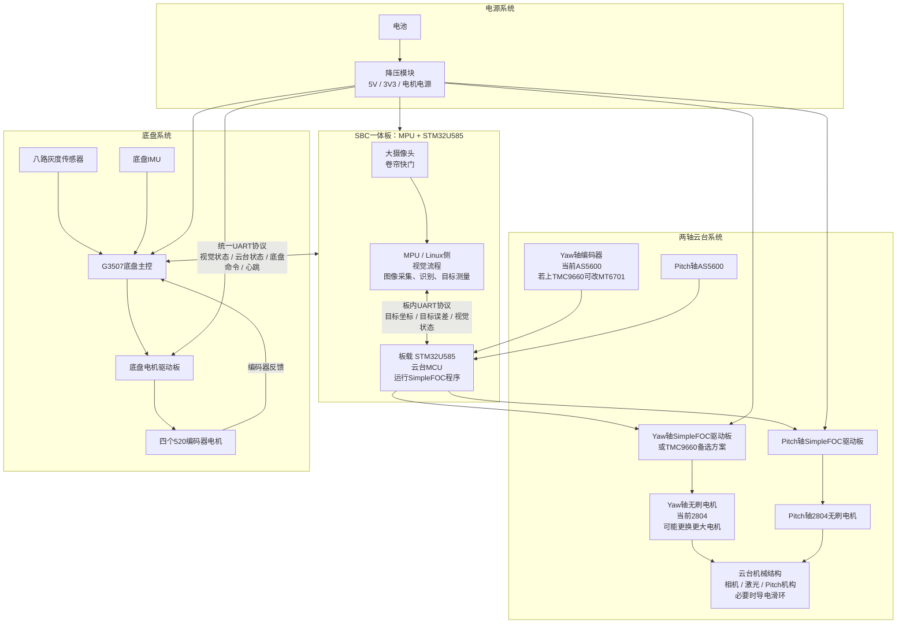
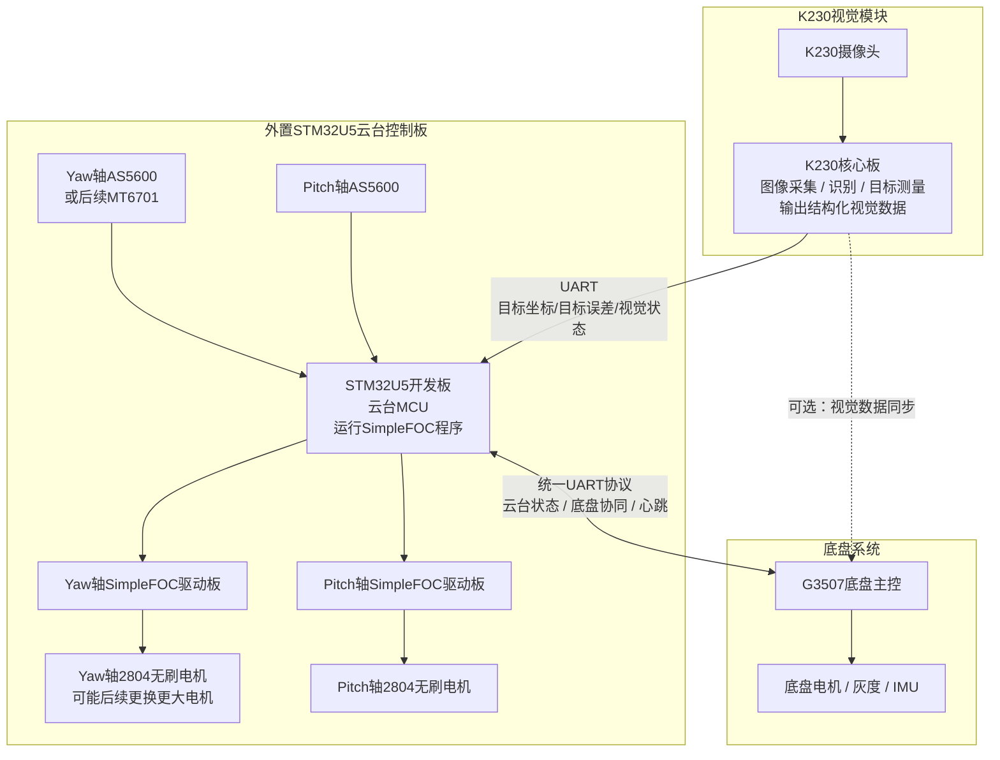
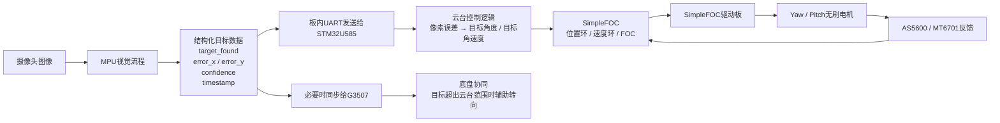
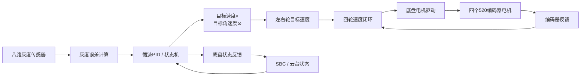
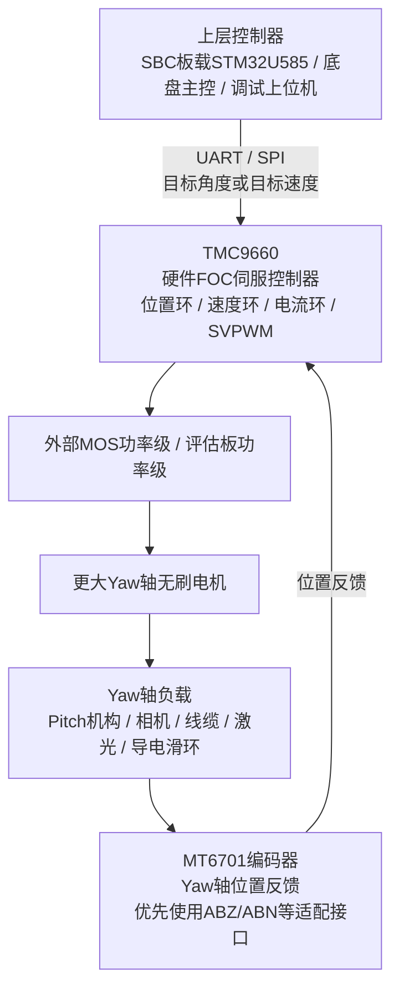

# 系统理解

## 模块架构图

## 最新系统框架图：SBC集成视觉与云台控制方案

### 总体架构



### 备选方案

#### K230视觉 + 外置STM32U5云台MCU



#### 备选方案定位

该方案的作用：

* 快速验证视觉输出数据是否可用；
* 快速验证视觉误差到云台动作的控制链路；
* 在SBC方案尚未完全确认前，为云台和底盘联调提供可运行平台；
* 协助制定统一UART协议；
* 让底盘可以提前接收“视觉目标状态 / 云台状态”等数据进行联调；
* 若SBC板载STM32U585开发或SimpleFOC适配受阻，可临时回退到该方案。

该方案的缺点：

* K230 + 外置STM32U5开发板体积更大；
* 线缆和供电更复杂；
* 最终上车空间压力较大；
* 不是最终集成优先方案，更适合作为调试过渡方案。

### 视觉与云台控制数据流



### 底盘控制数据流

(还没加入mpu6500)



### Yaw轴TMC9660备选路线



### 待验证问题

```text
SBC方案：
[ ] MPU侧视觉结果的输出字段、频率、延迟
[ ] MPU侧与STM32U585之间的板内UART协议
[ ] STM32U585是否方便运行SimpleFOC或厂商等效电机控制程序
[ ] STM32U585的PWM / I2C资源是否足够控制两轴云台
[ ] 两个AS5600的I2C地址冲突如何解决
[ ] SBC与G3507之间的统一UART协议帧格式
...

云台方案：
[ ] 当前2804 Yaw轴转矩是否足够
[ ] Pitch机构、相机、线缆对Yaw轴转动惯量的影响
[ ] 是否需要更大Yaw轴电机
[ ] 若Yaw轴换大电机，TMC9660 + MT6701方案是否可行
[ ] 若使用导电滑环，电源线、信号线、编码器线如何分配
...

底盘方案：
[ ] G3507底盘主控与SBC之间的UART通信频率
[ ] 底盘状态反馈字段
[ ] 云台到限位后，底盘是否需要辅助转向
[ ] 视觉目标丢失时，底盘和云台如何进入安全状态\
...
```

## 代码接口统一

```
通信协议格式；
数据单位，比如角度用 degree 还是 rad，速度用 rpm 还是 m/s；
坐标正方向，比如 error_x > 0 到底表示目标在右边还是左边；
状态枚举，比如 MODE_TRACK = 2；
故障码；
对外接口函数命名
```

## 模块任务

### 视觉

* 硬件与基础环境
* 图像预处理
* 识别与测量
* 视觉决策
* 通信接口
* 实际环境测试

### 云台

* 云台机械结构
* 无刷电机驱动
* 角度反馈
* 控制环
* 标定与保护

### 底盘

* 电机与驱动硬件
* 单电机基础控制
* 速度闭环
* 底盘运动封装
* 循迹控制
* IMU与姿态控制
* 故障和安全
