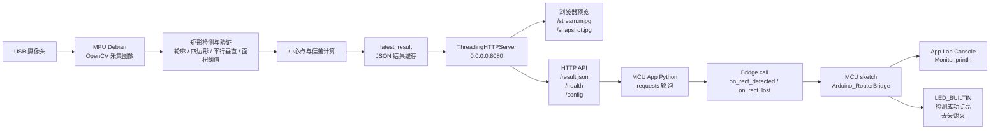
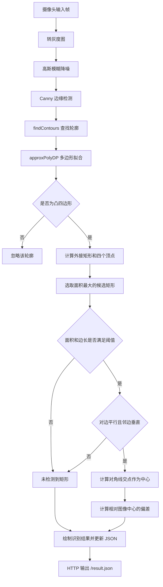

# Arduino UNO Q 矩形识别双核方案

本项目是在 Arduino UNO Q 上运行的矩形中心识别系统，采用 MPU + MCU 双核协同架构：

- MPU 侧运行 Debian + Python + OpenCV，负责摄像头采集、矩形识别、中心点计算、Web 预览和 HTTP API 输出。
- MCU 侧运行 Arduino App Lab 应用，负责轮询 MPU 识别结果，通过 Bridge RPC 通知 sketch，并在 Console 与板载 LED 上输出状态。

当前方案适合电赛视觉定位、矩形靶识别、目标中心偏差计算和后续舵机/电机闭环控制扩展。

## 项目结构

```text
矩形识别(双核)/
├── README.md
├── mpu/
│   ├── main.py          # Debian 主机侧 OpenCV 检测与 HTTP 服务
│   ├── run_host.sh      # MPU 侧启动脚本
│   └── README.md        # MPU 侧详细说明
└── mcu/
    └── rectangle-detection/
        ├── app.yaml
        ├── README.md
        ├── python/
        │   └── main.py  # App Lab Python 侧，HTTP 轮询 + Bridge.call
        └── sketch/
            ├── sketch.ino   # MCU sketch，Monitor 输出 + LED 指示
            └── sketch.yaml  # Arduino 库依赖
```

## 整体架构



双核分工可以概括为：

| 模块 | 运行位置 | 主要职责 |
| --- | --- | --- |
| 图像采集 | MPU / Debian | 使用 OpenCV 打开摄像头，获取 640 x 480 视频帧 |
| 视觉识别 | MPU / Debian | 提取边缘、查找轮廓、拟合四边形、验证矩形 |
| 结果服务 | MPU / Debian | 通过 `:8080` 提供 Web 页面、视频流和 JSON 结果 |
| 数据轮询 | MCU App Python | 每 10 ms 请求一次 `/result.json`，用 `timestamp` 去重 |
| MCU 控制 | MCU sketch | 接收 Bridge RPC，输出检测状态，控制板载 LED |

## 图像处理流程



中心点由矩形两条对角线交点得到，偏差定义为图像中心减去矩形中心：

$$
e_x = \frac{W}{2} - x_c
$$

$$
e_y = \frac{H}{2} - y_c
$$

其中 $W=640$，$H=480$，$(x_c,y_c)$ 为检测到的矩形中心。

## 数据链路

MPU 侧 `mpu/main.py` 会维护最新检测结果，并通过 HTTP 返回 JSON：

```json
{
  "status": "streaming",
  "rect_detected": true,
  "center": [320, 240],
  "error": [0, 0],
  "vertices": [[100, 100], [540, 100], [540, 380], [100, 380]],
  "area": 152000,
  "s_threshold": 2000,
  "timestamp": 1234567890.123
}
```

MCU App Python 侧读取该 JSON 后按状态分发：

```text
rect_detected = true
    -> Bridge.call("on_rect_detected", cx, cy, ex, ey)

rect_detected = false
    -> Bridge.call("on_rect_lost")
```

MCU sketch 中注册了两个 RPC 入口：

| RPC 函数 | 参数 | 行为 |
| --- | --- | --- |
| `on_rect_detected` | `cx, cy, ex, ey` | 检测计数加一，点亮 LED，打印中心和偏差 |
| `on_rect_lost` | 无 | 丢失计数加一，熄灭 LED，打印丢失次数 |

## 启动步骤

### 1. 启动 MPU 侧视觉服务

在 Arduino UNO Q 的 Debian 环境中进入 MPU 目录：

```bash
cd "D:\IEEE Project\PUEDC\视觉\UNO\矩形识别(双核)\mpu"
python3 main.py
```

也可以使用启动脚本：

```bash
cd "D:\IEEE Project\PUEDC\视觉\UNO\矩形识别(双核)\mpu"
./run_host.sh
```

启动后访问：

```text
http://<board-ip>:8080
```

常用检查接口：

```bash
curl http://<board-ip>:8080/health
curl http://<board-ip>:8080/result.json
```

### 2. 配置 MCU 侧访问地址

MCU App 运行在 App Lab 容器中，容器内的 `localhost` 指向容器自身，不是 Debian 宿主系统。因此 MCU App Python 侧必须访问宿主实际 IP。

当前代码默认：

```python
MPU_HOST = os.environ.get("MPU_HOST", "10.83.100.145")
MPU_URL = f"http://{MPU_HOST}:8080/result.json"
```

如果板子的 IP 变化，需要修改 `mcu/rectangle-detection/python/main.py` 中的默认 IP，或通过环境变量 `MPU_HOST` 指定。

### 3. 启动 MCU App

通过 Arduino App Lab 界面启动 `rectangle detection` 应用，或使用命令行：

```bash
arduino-app-cli app start user:rectangle-detection
```

查看日志：

```bash
arduino-app-cli app logs user:rectangle-detection
```

停止应用：

```bash
arduino-app-cli app stop user:rectangle-detection
```

## HTTP 接口

| 路径 | 方法 | 说明 |
| --- | --- | --- |
| `/` | GET | Web 预览页面 |
| `/stream.mjpg` | GET | MJPEG 实时视频流 |
| `/snapshot.jpg` | GET | 当前帧 JPEG 快照 |
| `/health` | GET | 服务状态 |
| `/result.json` | GET | 最新检测结果 |
| `/config` | GET | 当前检测参数 |
| `/threshold/increase` | POST | 增大面积阈值 |
| `/threshold/decrease` | POST | 减小面积阈值 |

## 关键参数

| 参数 | 默认值 | 说明 |
| --- | --- | --- |
| `CAMERA_INDEX` | `0` | OpenCV 摄像头编号 |
| `WIDTH` | `640` | 图像宽度 |
| `HEIGHT` | `480` | 图像高度 |
| `FPS` | `30` | 目标帧率 |
| `canny_thresh1` | `50` | Canny 低阈值 |
| `canny_thresh2` | `150` | Canny 高阈值 |
| `approx_epsilon` | `0.04` | 多边形拟合精度 |
| `area_min_ratio` | `0.001` | 最小轮廓面积比例 |
| `S_THRESHOLD` | `2000` | 矩形面积阈值 |
| `length_threshold` | `120` | 对边长度差阈值 |
| `CHECK_INTERVAL` | `0.01` | MCU App 轮询周期，单位秒 |

## 调试要点

1. 先确认 MPU 服务正常：

```bash
curl http://<board-ip>:8080/health
curl http://<board-ip>:8080/result.json
```

2. 如果 MCU App 显示连接失败，优先检查 `MPU_HOST` 是否为 Debian 宿主 IP。

3. 如果 Web 页面有画面但一直 `NO RECT`，调试 `S_THRESHOLD`、光照、边缘清晰度和矩形面积。

4. 如果 App Lab Console 没有 sketch 输出，检查 `Bridge.begin()`、`Bridge.provide()` 和 App 是否已经真正启动。

5. 如果 LED 状态与预期相反，注意当前 sketch 中 `LOW` 为点亮，`HIGH` 为熄灭。

## 后续扩展

- 将 `error` 偏差接入舵机或电机控制，实现自动对准。
- 在 MCU 侧统计检测成功率、平均偏差和丢失次数。
- 在 MPU 侧增加 HSV 阈值、形态学滤波或多目标筛选，提高复杂背景下的鲁棒性。
- 将 `/result.json` 增加目标置信度、边长、角度等字段，便于闭环控制调参。
